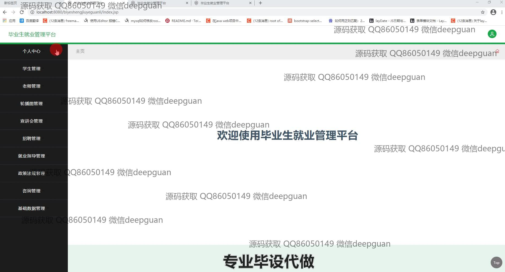
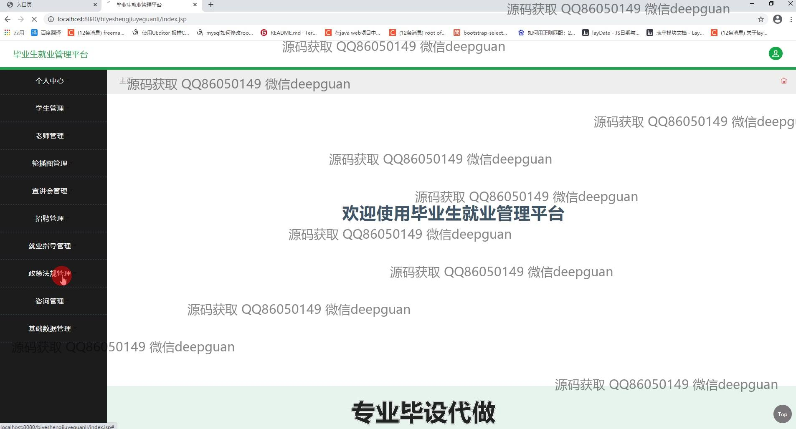
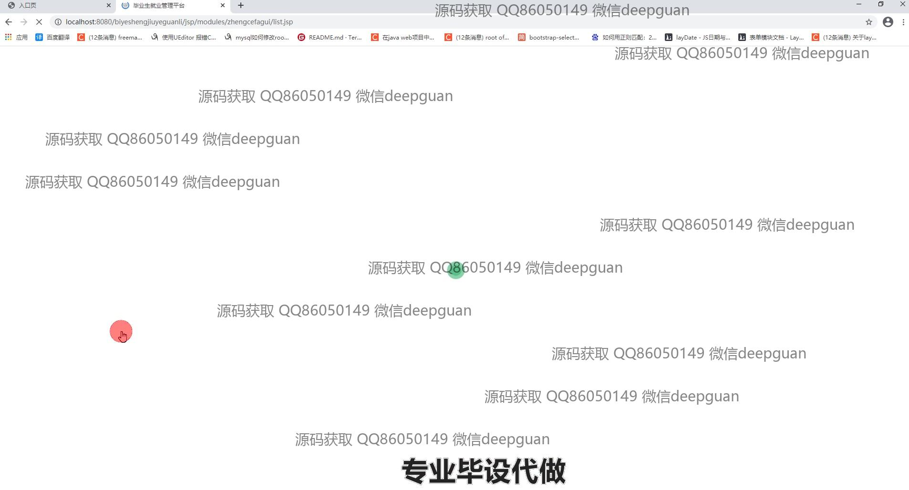

<h1 align="center">毕业生就业管理平台</h1>

## 简介
毕业生就业管理平台：提供学生、教师、宣讲会、招聘等管理功能，支持就业数据统计与分析、政策法规管理、个性化信息编辑，提升毕业生的就业服务与信息管理效率。    --计算机毕业设计源码；毕设源码；java毕业设计源码

## 联系方式

<h3 align="center">获取完整代码与数据库文件 + 微信：deepguan QQ: 86050149 QQ群: 783742310</h3>

<h3 align="center">可帮忙远程部署 包运行成功！提供远程部署、修改代码、设计文档指导、代码讲解等服务！</h3>

## 功能介绍（完整见运行截图）
管理员：基本功能包括登录、注册和退出，网站首页提供导航栏和公告展示。平台支持学生、教师、招聘及就业指导的全面管理，功能涵盖个人信息编辑、职位发布和数据统计分析。政策法规和咨询管理也可通过平台进行，确保信息的实时维护与更新。管理员可执行用户权限设置、数据备份等操作，维护系统安全和稳定性。

学生：需要登录后可访问个人中心，查看和更新个人信息，如联系方式、学业状态及就业意向。同时能浏览最新宣讲会和招聘信息，通过平台直接投递简历。学生可在平台中统计就业数据，获取个性化指导，提升求职效果。

教师：可通过平台查看学生就业信息，提供就业指导，更新和维护教师个人信息。平台支持教师参与宣讲会管理，查看招聘信息，有助于教师为学生提供更精准的指导和支持。

招聘企业：登录后可发布招聘信息，管理职位申请，浏览学生的投递简历。平台提供宣讲会的管理模块，招聘企业可通过平台发布宣讲会信息，吸引更多学生参与，提升招聘效果。

## 运行截图

本代码来源于网络,仅供学习参考使用!

